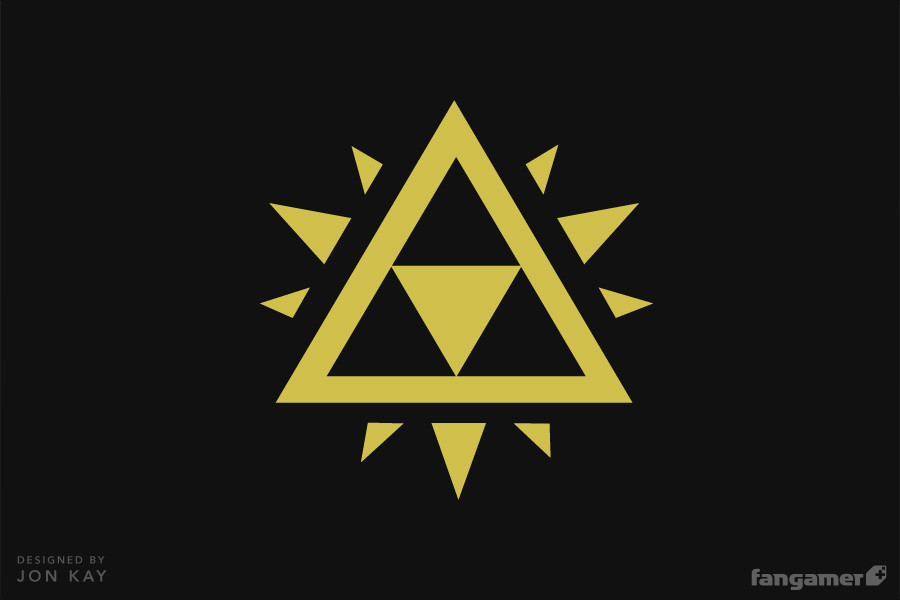

# Hello, JA54312 is Here! 👋

`Fantasy or Reality?,,Reality when needed, Fantasy always` <em> I'm **Aeronautic Engineer**, **Renewable Energy Engineer in Process**, **Amateur Front End**,**Amateur podcaster** and **#Gamer** lover.I am in the process of growth, I know React basic and I continue learning React.</em>

## Tech Stack ⌨
- HTML 5⭐
- CSS3 ⭐
- Javascript
- C++
- C#
- Bootstrap
- React

<h3 align="center">Let's connect 😋</h3>

 &nbsp; &nbsp;
 &nbsp; &nbsp;
 &nbsp; &nbsp;
 &nbsp; &nbsp;

